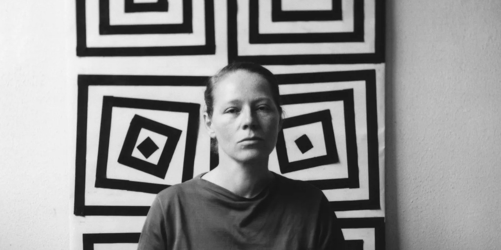

# VERA  

VERA is powerful C++14 and OpenGL/WebGL framework designed for creating and displaying real-time visual application in a big variety of surfaces and devices. 

## Features
VERA brings low level support for moder CG techniques such us:
- GLSL Shaders affordances for: hot-reloading, libraries (ex: [LYGIA](https://lygia.xyz/)) and define flag injection
- Geometry generation and manipulation (2D/3D)
- Camera controls (orbit, first-person, etc)
- Transform stack (push/pop)
- Basic 2D/3D drawing API (points, lines, shapes, meshes, etc)
- Textures loading and manipulation
- Offscreen Framebuffers
- Double buffering (ping-pong)
- Post-processing effects
- Pyramid algorithms (ex: poisson fill)
- Flood algorithms (ex: jump flood for sdf generation)
- FXAA Anti-aliasing
- 3D Models loading and rendering, including: PLY, OBJ, GLTF/GLB and STL formats.
- GSPLAT loading and rendering
- PBR Materials
- HDRI Environments and Lighting
- Dynamic Atmospheric Lighting
- Shadow Mapping
- TTF Font loading and rendering
- Audio input analysis (FFT, Amplitude)
- Video input/output (ffmpeg based)
- Histogram Equalization
- Centralize asset management (shaders, textures, models, fonts, lights, etc)

VERA applications can be compiled as:
- native OpenGL/ES app on Linux, Windows and MacOS (with support for ARM and x86 architectures)
- console OpenGL/ES app for embebed systems (such us Raspberry Pi, Nvidia Jetson Nano, Khadas VIM4, etc) with out window manager
- browser WASM/WebGL2 app 

VERA brings support for more novel displays and surfaces such us:
- [Looking Glass Holographic Displays](https://lookingglassfactory.com/)
- [WebXR](https://www.w3.org/TR/webxr/)

## About VERA
VERA is the merge between, [ADA](https://github.com/patriciogonzalezvivo/ada) (a minimal library to create OpenGL ES & WebGL apps) and [HILMA](https://github.com/patriciogonzalezvivo/hilma) (a 2D/3D geometry library). 

VERA have an `App` class and a drawing API similar to [P5js's API](https://p5js.org/reference/) that could be use for more novel artist that are searching to improve the performance of their art works or displaying them in a bigger set of formats, devices or displays. This doesn't mean P5js code, addons and plugins will work out of the box in VERA, but mostly that `app.h` and `ops/draw.h` will provide functionality familiar and (when possible) width identical behavior. At the end of the day C++ is a different programing language with specific and unique sintax. Hopefully VERA can also serve for generative or novel artist already familiar to [Processing](https://p5js.org/reference/) and [P5js](https://p5js.org/reference/) that desire to adventure into C++. It can be provide a nice transition to [OpenFrameworks](https://github.com/openframeworks/openFrameworks) and [Cinder](https://github.com/cinder/Cinder).

Ultimatelly VERA is designed to let artist code their works once and display them in a biffer range of surfaces. From native apps to custom displays powered by embebed systems such us [Raspberry Pi](https://www.raspberrypi.org/); or from holographic screen like those from [Looking Glass Factory](https://lookingglassfactory.com/), sandboxed web app (like [generative NFT projects](https://objkt.com/asset/hicetnunc/447619) ) to [AR/VR experiences through WebXR protocol](https://www.w3.org/TR/webxr/).

## Examples and projects using VERA

- [empty example](https://patriciogonzalezvivo.github.io/vera_empty/)
- [hello world example](https://patriciogonzalezvivo.github.io/vera_hello_world/).
- [gsplat render example](https://patriciogonzalezvivo.github.io/vera_gsplat/) 

## Support VERA

By sponsoring VERA development or contribute by helping to:
- fix bugs
- improve the documentation
- create more examples
- bring support for more devices and type of displays (specifically embebed systems such us Raspberry Pi, Nvidia Jetson Nano, Khadas VIM4, etc)
- expand the drawing API (`ops/draw.h`) to better match P5js API
- migrate the underlying graphic API to WebGPU
